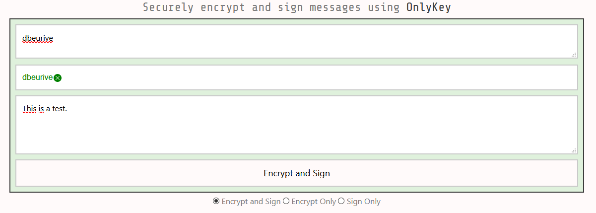

# OnlyKey notes


## Install / update the desktop application

URL: [Install the desktop app](https://docs.onlykey.io/app.html)

> It is possible to find out the version of the last release by looking at the download link ((here)[https://docs.onlykey.io/app.html#app-desktop]). For example: `https://github.com/trustcrypto/OnlyKey-App/releases/download/v5.3.6/OnlyKey_5.3.6.exe`. You can see that the last version is `5.3.6`.

Check the version of the installed version:


## Install / update the CLI utility

URL: [Install onlykey-cli.exe](https://docs.onlykey.io/command-line.html)

> Under Windows, you should use the [standalone version](https://docs.onlykey.io/command-line.html#windows-stand-alone-exe).

Check the version of the CLI utility: `onlykey-cli version`

Few other commands:

```
onlykey-cli fwversion
onlykey-cli wink
onlykey-cli getlabels
onlykey-cli getkeylabels
```

> Full list of commands: [https://docs.onlykey.io/command-line.html#quickstart](https://docs.onlykey.io/command-line.html#quickstart)

> It is possible to find out the version of the last release by looking at the download link ((here)[https://docs.onlykey.io/command-line.html#installation]). For example: `https://github.com/trustcrypto/python-onlykey/releases/download/v1.2.9/onlykey-cli.exe`. You can see that the last version is `1.2.9`.

## General information about the OnlyKey

OnlyKey firmware version:

```
C:\>onlykey-cli.exe fwversion
    
v2.1.0-prodc
```

## LED behavior

* **Permanently blinking red**: the [config mode](https://docs.crp.to/security.html) is enabled. In this mode, you can, among other things, set a new backup passphrase. _To enable the config mode: hold down the #6 button on your OnlyKey for 5+ seconds and release. The OnlyKey light will turn off. Re-enter your current primary PIN to enter config mode and notice the OnlyKey flashes red._
* **Permanently blinking blue**: you are using the key to authenticate on a WEB service (Ex: GitHub) - as a "security key". You are asked to touch one of the 6 buttons (on the key).

## Configuration

### Set the backup passphrase

* Insert the key into the USB slot.
* Enter the PIN (using the 6 keys on the device). The LED is green.
* Turn on the [config mode](https://docs.crp.to/security.html): _to enable the config mode: hold down the #6 button on your OnlyKey for 5+ seconds and release. The OnlyKey light will turn off. Re-enter your current primary PIN to enter config mode and notice the OnlyKey flashes red._
* Open the desktop application.
* Select the tab `Setup`.
* Enter the passphrase.
* Click `Next`.

You should see a message that says, essentially, that the operation was successful.

## Backup / Restore

### Prerequisite

* you must set a backup passphrase (to the key being backed up) prior to back up a key.
* you must set a backup passphrase (to the key upon which the backup is restored) prior to restore a back up.
* if you restore key `K1`’s backup to key `K2`, the same backup passphrase must be set on `K1` and `K2`.

### Backup

Online documentation: [Secure Encrypted Backup Anywhere](https://docs.onlykey.io/usersguide.html#restore-from-backup)

Procedure:
* Insert the key into the USB slot.
* Enter the PIN (using the 6 keys on the device). The LED is green.
* Open the desktop application.
* Select the tab `Backup/Restore`.
* Click on the text area `Backup data`.
* Hold the #1 button down on your OnlyKey for 5+ seconds and release. 
* Wait until the operation ends.

> Please note: you don't have to use the desktop application to back up the OnlyKey. You can, for example, open a text editor (notepad, for example), click in the text area (in the text editor), and hold the #1 button down on your OnlyKey for 5+ seconds and release. The text that represents the backup will be written directly in the text editor.

> Please note: for windows users, you can use PoweShell to copy the content of the backup file to the clipboard.
> For example:
>
> ```
> PS C:> $text = Get-Content .\onlykey-backup-2023-10-11T21-13.txt -Raw 
> PS C:> Set-Clipboard -Value $text
> ```
>
> Then you can paste the content of the file `onlykey-backup-2023-10-11T21-13.txt` in any application (`[Ctrl]+[V]`).

### Restore

Online documentation: [Restore From Backup](https://docs.onlykey.io/usersguide.html#restore-from-backup)

* Insert the key into the USB slot.
* Enter the PIN (using the 6 keys on the device). The LED is green.
* Open the desktop application.
* Select the tab `Backup/Restore`.
* Hold the #6 button down on your OnlyKey for 5+ seconds and release.
  The light turns off. Then (re)enter the PIN (using the 6 keys on the device). You will see the OnlyKey LED fade in and out continuously (Red) while in config mode.
* Select the file that contains the backup to restore.
* Click on the button "Restore the OnlyKey".  
* Wait until the operation ends.

> When the operation completes, the key reboots and you must (re)enter the PIN.

## Encrypt / Decrypt

Go to [OnlyKey Apps](https://apps.crp.to/).

### Generate a PGP key pair

First, you need a PGP key pair. You can generate these key pair with OpenSSL or with the KeyBase utility, for example. Here we use the KeyBase utility.

Please note that the keybase command line utility is installed under this directory:

    "%HOMEPATH%\AppData\Local\Keybase"

> You can add this path to PATH environment variable (however, the installation wizard should do it for you).

Generate a PGP keypair:

    "%HOMEPATH%\AppData\Local\Keybase"\keybase pgp gen

> Please note that this command will automatically send the generated public key to the KeyBase database.
> However, the private key is not sent to the KeyBase database.

To get the generated private key, execute the following command ([CF this post](https://github.com/keybase/client/issues/7450)):

    "%HOMEPATH%\AppData\Local\Keybase"\keybase pgp export -s > priv_keybase.txt


> Please note: for windows users, you can use PoweShell to copy the content of the private key file to the clipboard.
> For example:
>
> ```
> PS C:> $text = Get-Content .\priv_keybase.txt -Raw 
> PS C:> Set-Clipboard -Value $text
> ```
>
> Then you can paste the content of the file `priv_keybase.txt` in any application (`[Ctrl]+[V]`).

### Import the PGP private key into the OnlyKey

* Start the OnlyKey desktop application.
* Click on the tab "Key".
* Enable on the config mode: _to enable the config mode: hold down the #6 button on your OnlyKey for 5+ seconds and release. The OnlyKey light will turn off. Re-enter your current primary PIN to enter config mode and notice the OnlyKey flashes red._
* Paste the "text" that represents the private key to add into the text input "Key". Please note that this "text" is the content of the file "priv_keybase.txt".
* Enter the passphrase that protects the private key (if any).
* Click "Save to OnlyKey".

### Send a signed / encrypted message

Go to [OnlyKey Apps](https://apps.crp.to/).

Click on "Encrypt & Sign messages".

* Enter the KeyBase ID (or ProtonMail email address or public key) for the recipient.
* Enter the KeyBase ID (or ProtonMail email address or public key) for the sender.
* Type the message.
* Then click "Encrypt and Sign".



**Watch out !!!** You will be asked to type a 3-digit code on the OnlyKey!

	OnlyKey WebCrypt Log Will Appear Here
	PGP Mode to Encrypt and Sign
	OKPGP(Encrypt and Sign): Checking recipient's public key...
	OKPGP(Encrypt and Sign): Checking sender's public key...
	OKPGP(Encrypt and Sign): Encrypting and signing message ...
	OKPGP(Encrypt and Sign): You have 10 seconds to enter challenge code 6,3,4 on OnlyKey.
	OKPGP(Encrypt and Sign): You have 9 seconds to enter challenge code 6,3,4 on OnlyKey.
	OKPGP(Encrypt and Sign): You have 8 seconds to enter challenge code 6,3,4 on OnlyKey.
	OKPGP(Encrypt and Sign): You have 7 seconds to enter challenge code 6,3,4 on OnlyKey.
	OKPGP(Encrypt and Sign): You have 6 seconds to enter challenge code 6,3,4 on OnlyKey.
	OKPGP(Encrypt and Sign): You have 5 seconds to enter challenge code 6,3,4 on OnlyKey.
	OKPGP(Encrypt and Sign): You have 4 seconds to enter challenge code 6,3,4 on OnlyKey.
	OKPGP(Encrypt and Sign): You have 3 seconds to enter challenge code 6,3,4 on OnlyKey.
	OKPGP(Encrypt and Sign): You have 2 seconds to enter challenge code 6,3,4 on OnlyKey.
	OKPGP(Encrypt and Sign): Waiting for OnlyKey to process message.
	OKPGP(Encrypt and Sign): Done :)  Click here to copy message, then paste encrypted message into an email, IM, whatever.

Enter the 3-digit pin (here "6-3-4") on the OnlyKey and you get the encryted message.

### Decrypt and verify a message

Go to [OnlyKey Apps](https://apps.crp.to/).

Click on "Decrypt & Verify messages".

* Enter the KeyBase ID (or ProtonMail email address or public key) for the sender.
* Enter your KeyBase ID (or ProtonMail email address or public key).
* Past the encrypted message.
* Then click "Decrypt and Verify".

**Watch out !!!** You will be asked to type a 3-digit code on the OnlyKey!

## Using the OnlyKey with online accounts

### GitHub account

Follow the instructions here: [Configuring two-factor authentication](https://docs.github.com/en/github/authenticating-to-github/configuring-two-factor-authentication#configuring-two-factor-authentication-using-fido-u2f)

First you need to configure two-factor authentication using a TOTP. To do that, install [Twilio Authy 2-Factor Authentication application](https://authy.com/download/) on your smartphone or your desktop computer.

Then configure a security key (such as the OnlyKey), on the [GitHub Settings page](https://github.com/settings/two_factor_authentication/configure).

**WARNING**: by the 4th of april 2021, the procedure does not work with FireFox (version `87.0` - 64 bits) on Windows 10. It works with:

* Edge (version `89.0.774.68`). 
* Chrome (version `89.0.4389.114`).

**Step 1**

Connect the OnlyKey on the computer and unlock it.

**Step 2**

On the section "Security keys" ([here](https://github.com/settings/two_factor_authentication/configure)), enter a name for the key (for example "OnlyKey") and click on the "Add" button.


**Step 3**

The led on the OnlyKey blinks blue.

**Step 4**

When asked to perform an action on the device, just touch one button on the OnlyKey.

That's it.

## Notes

* Disable Firefox auto filling forms: [https://support.mozilla.org/en-US/kb/autofill-logins-firefox](https://support.mozilla.org/en-US/kb/autofill-logins-firefox)

