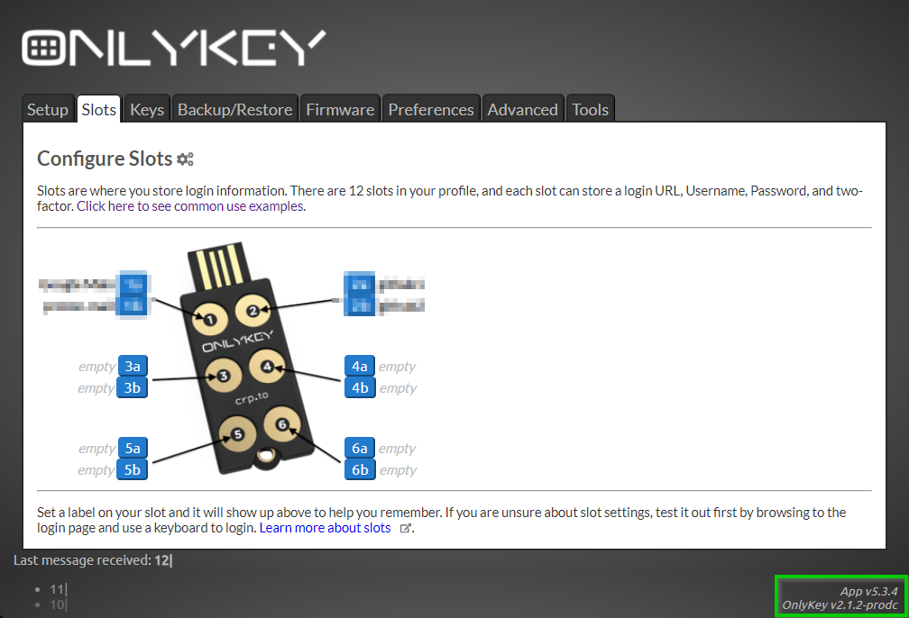

# Install / update the desktop application

URL: [Install the desktop app](https://docs.onlykey.io/app.html)

> It is possible to find out the version of the last release by looking at the download link ((here)[https://docs.onlykey.io/app.html#app-desktop]). For example: `https://github.com/trustcrypto/OnlyKey-App/releases/download/v5.3.6/OnlyKey_5.3.6.exe`. You can see that the last version is `5.3.6`.

Check the version of the installed version:

