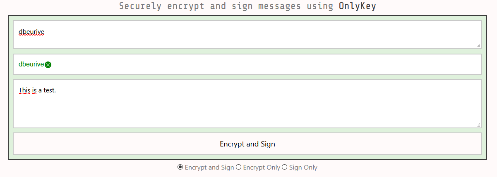

# Encrypt / Decrypt

Go to [OnlyKey Apps](https://apps.crp.to/).

## Generate a PGP key pair

First, you need a PGP key pair. You can generate these key pair with OpenSSL or with the KeyBase utility, for example. Here we use the KeyBase utility.

Please note that the keybase command line utility is installed under this directory:

    "%HOMEPATH%\AppData\Local\Keybase"

> You can add this path to PATH environment variable (however, the installation wizard should do it for you).

Generate a PGP keypair:

    "%HOMEPATH%\AppData\Local\Keybase"\keybase pgp gen

> Please note that this command will automatically send the generated public key to the KeyBase database.
> However, the private key is not sent to the KeyBase database.

To get the generated private key, execute the following command ([CF this post](https://github.com/keybase/client/issues/7450)):

    "%HOMEPATH%\AppData\Local\Keybase"\keybase pgp export -s > priv_keybase.txt


> Please note: for windows users, you can use PoweShell to copy the content of the private key file to the clipboard.
> For example:
>
> ```
> PS C:> $text = Get-Content .\priv_keybase.txt -Raw 
> PS C:> Set-Clipboard -Value $text
> ```
>
> Then you can paste the content of the file `priv_keybase.txt` in any application (`[Ctrl]+[V]`).

## Import the PGP private key into the OnlyKey

* Start the OnlyKey desktop application.
* Click on the tab "Key".
* Enable on the config mode: _to enable the config mode: hold down the #6 button on your OnlyKey for 5+ seconds and release. The OnlyKey light will turn off. Re-enter your current primary PIN to enter config mode and notice the OnlyKey flashes red._
* Paste the "text" that represents the private key to add into the text input "Key". Please note that this "text" is the content of the file "priv_keybase.txt".
* Enter the passphrase that protects the private key (if any).
* Click "Save to OnlyKey".

## Send a signed / encrypted message

Go to [OnlyKey Apps](https://apps.crp.to/).

Click on "Encrypt & Sign messages".

* Enter the KeyBase ID (or ProtonMail email address or public key) for the recipient.
* Enter the KeyBase ID (or ProtonMail email address or public key) for the sender.
* Type the message.
* Then click "Encrypt and Sign".



**Watch out !!!** You will be asked to type a 3-digit code on the OnlyKey!

	OnlyKey WebCrypt Log Will Appear Here
	PGP Mode to Encrypt and Sign
	OKPGP(Encrypt and Sign): Checking recipient's public key...
	OKPGP(Encrypt and Sign): Checking sender's public key...
	OKPGP(Encrypt and Sign): Encrypting and signing message ...
	OKPGP(Encrypt and Sign): You have 10 seconds to enter challenge code 6,3,4 on OnlyKey.
	OKPGP(Encrypt and Sign): You have 9 seconds to enter challenge code 6,3,4 on OnlyKey.
	OKPGP(Encrypt and Sign): You have 8 seconds to enter challenge code 6,3,4 on OnlyKey.
	OKPGP(Encrypt and Sign): You have 7 seconds to enter challenge code 6,3,4 on OnlyKey.
	OKPGP(Encrypt and Sign): You have 6 seconds to enter challenge code 6,3,4 on OnlyKey.
	OKPGP(Encrypt and Sign): You have 5 seconds to enter challenge code 6,3,4 on OnlyKey.
	OKPGP(Encrypt and Sign): You have 4 seconds to enter challenge code 6,3,4 on OnlyKey.
	OKPGP(Encrypt and Sign): You have 3 seconds to enter challenge code 6,3,4 on OnlyKey.
	OKPGP(Encrypt and Sign): You have 2 seconds to enter challenge code 6,3,4 on OnlyKey.
	OKPGP(Encrypt and Sign): Waiting for OnlyKey to process message.
	OKPGP(Encrypt and Sign): Done :)  Click here to copy message, then paste encrypted message into an email, IM, whatever.

Enter the 3-digit pin (here "6-3-4") on the OnlyKey and you get the encryted message.

## Decrypt and verify a message

Go to [OnlyKey Apps](https://apps.crp.to/).

Click on "Decrypt & Verify messages".

* Enter the KeyBase ID (or ProtonMail email address or public key) for the sender.
* Enter your KeyBase ID (or ProtonMail email address or public key).
* Past the encrypted message.
* Then click "Decrypt and Verify".

**Watch out !!!** You will be asked to type a 3-digit code on the OnlyKey!
